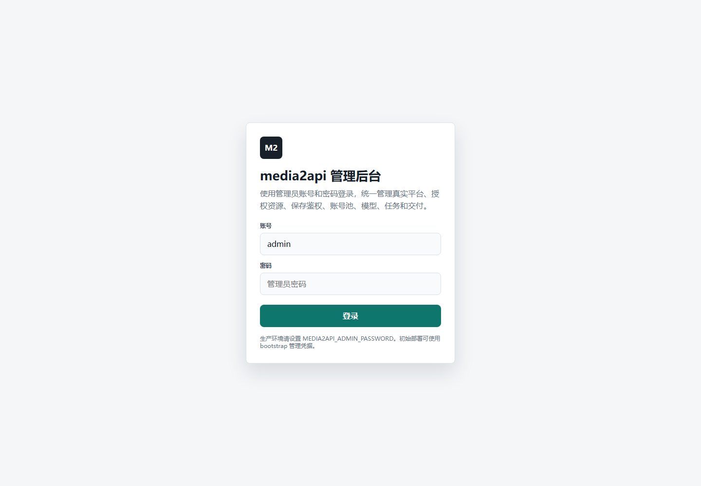
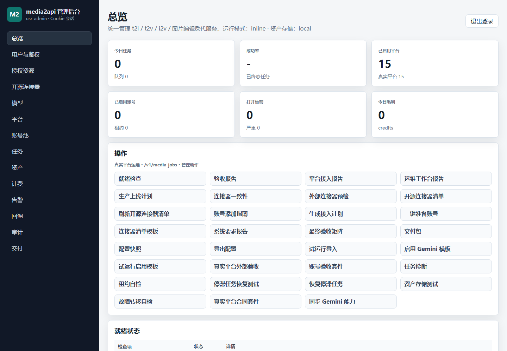
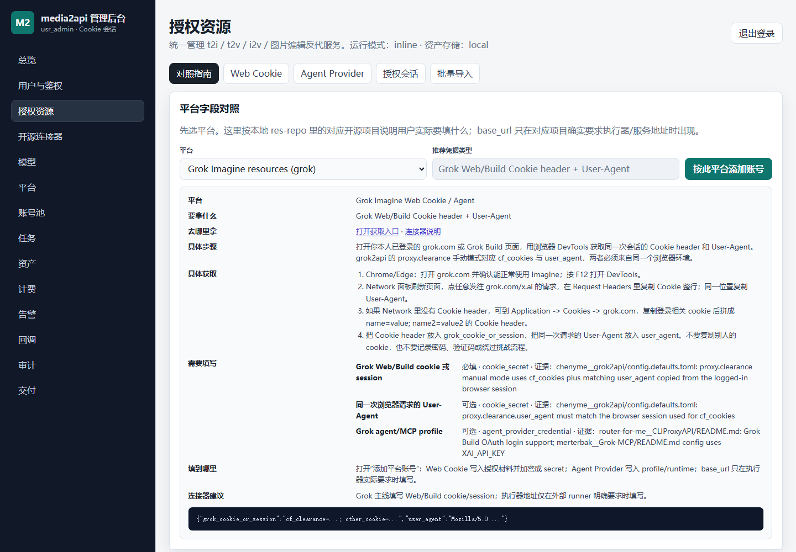
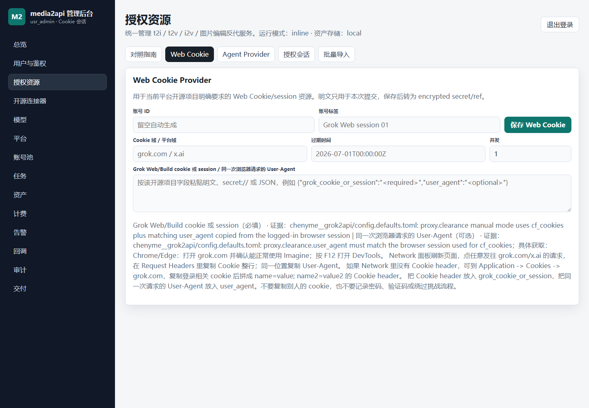
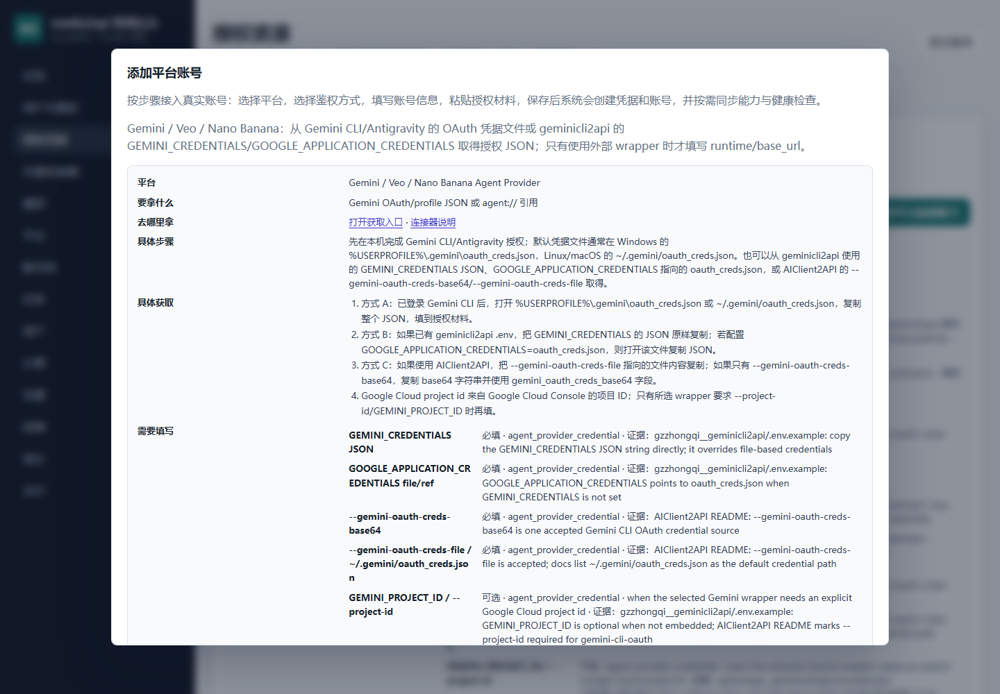

# media2api 管理后台使用教程

本文档基于当前源码和管理台页面编写，覆盖登录、查看系统状态、新增 Web Cookie 账号、新增 Agent Provider 账号，以及保存后的验证流程。当前产品定位只把上游资源抽象为两类：`Web Cookie` 和 `Agent Provider`。`base_url`、`runtime endpoint`、`runner endpoint` 只在对应开源项目确实要求外部执行器地址时填写，不作为所有账号都必须填写的通用字段。

## 1. 访问与登录

部署后的管理台入口为：

- 线上测试环境：`http://192.168.31.26:18082/admin`
- 本地开发环境：`http://127.0.0.1:8080/admin` 或启动时指定的端口

管理员账号默认为 `admin`。管理员密码来自环境变量 `MEDIA2API_ADMIN_PASSWORD`；当前测试环境使用 `dev-admin-key`。生产环境必须替换为独立强密码，并避免在文档或脚本中长期保留明文。



登录后浏览器会保存 `media2api_admin_key` cookie。后续调用管理接口时，也可以使用 `Authorization: Bearer <admin_key>` 或 `X-API-Key: <admin_key>`。

## 2. 页面结构

管理台采用左侧导航和右侧工作区结构。总览页用于检查服务健康度、provider 数量、账号数量、任务数量、待处理告警，以及常用操作入口。



常用模块说明：

| 模块 | 用途 |
| --- | --- |
| 总览 | 查看服务状态、平台数量、账号池数量、任务与资产概览 |
| 授权资源 | 按平台导入 Web Cookie 或 Agent Provider 账号，是新增真实账号的主入口 |
| 开源连接器 | 查看本地调研和导入的开源连接器，并生成接入计划 |
| 模型 | 查看逻辑模型、平台模型和操作映射 |
| 平台 | 查看真实 provider 是否启用 |
| 账号池 | 查看已保存账号、凭据引用、租约状态，并运行账号验收 |
| 任务/资产 | 查看生成任务和生成结果资产 |
| 返回结果 | 页面底部统一显示管理接口返回值、错误详情和验收结果 |

## 3. 授权资源入口

新增账号优先进入左侧的“授权资源”。页面顶部先选择平台，下面会按该平台源码画像展示需要的字段、支持的鉴权方式和证据说明。



子页签含义如下：

| 页签 | 适用场景 |
| --- | --- |
| 对照指南 | 查看当前平台要导入什么资源、字段来自哪个开源项目、是否需要外部执行器 |
| Web Cookie | 平台以网页登录态、cookie、session 为主，例如 Grok Web/Build |
| Agent Provider | 平台以 CLI profile、OAuth cache、agent 配置、MCP 配置为主，例如 Gemini CLI、Antigravity |
| 授权会话 | 仅在对应连接器提供授权助手、device login 或 profile capture 时使用 |
| 批量导入账号 | 从资源清单 URL、JSON 或 JSONL 导入一批账号资源 |

判断一个字段是否要填时，以页面“需要填写”的平台字段为准。没有显示的字段不要强行补；尤其不要把所有平台都当成“必须填连接器 baseurl”。

## 4. 新增 Grok 账户绑定

Grok 当前源码画像的主路径是 `Web Cookie`。也就是说，平台要保存的是你本人已经授权的 Grok Web/Build cookie 或 session 材料，系统保存后会转成 `secret://...` 凭据引用。



### Grok Cookie 具体去哪里拿

Grok 对应的开源证据来自 `grok2api`：它的手动 clearance 配置使用 `proxy.clearance.cf_cookies` 和 `proxy.clearance.user_agent`。因此这里不是让你填写账号密码，而是把你本人浏览器里已经登录成功的 Grok Web/Build 会话复制成 Cookie header，并且同时复制同一次请求的 User-Agent。

获取步骤：

1. 用 Chrome 或 Edge 打开你本人已登录的 Grok 页面，例如 `https://grok.com/` 或你实际使用的 Grok Build 入口。
2. 确认页面可以正常进入 Grok Imagine、图片或视频功能。
3. 按 `F12` 打开 DevTools。
4. 切到 `Network` 面板。
5. 刷新页面，点击一个发往 `grok.com`、`x.ai` 或当前 Grok Build 域名的请求。
6. 在右侧 `Headers` -> `Request Headers` 中复制 `cookie:` 后面的完整值。
7. 在同一个请求里复制 `user-agent:` 后面的完整值。
8. 如果 `Network` 面板没有显示 Cookie header，切到 `Application` -> `Cookies` -> 当前 Grok 域名，把登录相关 cookie 复制并拼成 `name=value; name2=value2` 格式。
9. 在 media2api 的 Web Cookie 表单中，把 Cookie header 填到授权材料 JSON 的 `grok_cookie_or_session`，把 User-Agent 填到 `user_agent`。

不要复制别人的 cookie，不要保存账号密码、验证码，也不要把绕过风控或挑战的流程写进系统。这里保存的是你本人已经授权的浏览器会话材料。

操作步骤：

1. 登录管理台。
2. 左侧点击“授权资源”。
3. 在“平台”下拉框选择 `grok`。
4. 先看“对照指南”，确认当前平台提示的是 `Grok Web/Build cookie 或 session`。
5. 切换到“Web Cookie”页签。
6. 填写“账号 ID”。可以留空让系统自动生成；建议生产环境使用可读 ID，例如 `acct_grok_cookie_01`。
7. 填写“账号标签”，例如 `Grok Web session 01`。
8. “Cookie 域”填写实际登录态所属域，例如 `grok.com` 或当前开源连接器要求的域。
9. “过期时间”可选。如果你知道 cookie 或 session 的过期时间，填写 ISO 时间，例如 `2026-07-01T00:00:00Z`。
10. “并发”建议先填 `1`。真实验收稳定后再提高。
11. 在授权材料输入框粘贴 Grok cookie、cookie jar 或 session JSON。
12. 点击“保存 Web Cookie Provider”。
13. 查看页面底部“返回结果”。成功时会看到新账号和 `secret://...` 凭据引用。
14. 左侧进入“账号池”，确认该账号状态为 `active` 或可被验收。
15. 点击“运行账号验收套件”，确认 Grok 图片或视频模型能真实提交任务。

推荐粘贴 JSON 结构，便于后端识别字段：

```json
{
  "grok_cookie_or_session": "cf_clearance=...; other_cookie=...",
  "user_agent": "Mozilla/5.0 ..."
}
```

也可以直接粘贴完整 Cookie header。只要平台字段能解析出 `grok_cookie_or_session`，后端就会把它保存为加密 secret。不要在 Grok Web Cookie 主路径中填写通用 API key，也不要填写与当前平台无关的 base URL。

常见失败：

| 错误 | 处理方式 |
| --- | --- |
| `PROVIDER_REQUIRED_INPUT_MISSING` | 没有提交 `grok_cookie_or_session`，请按 JSON 或 Cookie header 重新提交 |
| `PROVIDER_AUTH_METHOD_NOT_ALLOWED` | 当前页签或鉴权方式不匹配，Grok 主路径应使用 Web Cookie |
| `PROVIDER_BASE_URL_NOT_ALLOWED` | 当前 Grok 账号材料不需要通用 base URL，删除执行器地址后再保存 |
| `ACCOUNT_CREDENTIAL_REF_RESOURCE_MISMATCH` | 凭据类型和资源类型不匹配，Web Cookie 应对应 `cookie` 或 `cookie_secret` |

## 5. 新增 Gemini 账户绑定

Gemini 当前源码画像的主路径是 `Agent Provider`。系统保存的是 Gemini CLI、Antigravity、geminicli2api、CLIProxyAPI、CliRelay 或 AIClient2API 这类工具使用的授权材料，例如 OAuth cache、credential JSON、profile 或 agent 引用。



### Gemini 鉴权 JSON 具体去哪里拿

Gemini 对应的开源证据主要来自 `geminicli2api` 和 `AIClient2API`。它们接受的不是网页 cookie，而是 Gemini CLI/Antigravity/Agent Runtime 的 OAuth/profile 凭据。

可用来源：

| 来源 | 去哪里拿 | 填到 media2api 的字段 |
| --- | --- | --- |
| Gemini CLI 默认凭据文件 | Windows：`%USERPROFILE%\.gemini\oauth_creds.json`；Linux/macOS：`~/.gemini/oauth_creds.json` | `gemini_oauth_creds_file` 或直接把文件 JSON 填到 `gemini_credentials` |
| geminicli2api 环境变量 | `.env` 里的 `GEMINI_CREDENTIALS={...}` | `gemini_credentials` |
| geminicli2api 文件引用 | `.env` 里的 `GOOGLE_APPLICATION_CREDENTIALS=oauth_creds.json`，打开这个文件复制内容 | `google_application_credentials` 或 `gemini_credentials` |
| AIClient2API 文件参数 | 启动参数 `--gemini-oauth-creds-file /path/to/oauth_creds.json` 指向的文件 | `gemini_oauth_creds_file` 或 `gemini_credentials` |
| AIClient2API base64 参数 | 启动参数 `--gemini-oauth-creds-base64 <base64>` 的值 | `gemini_oauth_creds_base64` |
| Google Cloud 项目 ID | Google Cloud Console 顶部项目选择器里的 Project ID | `gemini_project_id`，只有 wrapper 要求时填写 |

本机路径换算：

| 系统 | `~` 或 `%USERPROFILE%` 对应位置 |
| --- | --- |
| Windows | `C:\Users\你的用户名` |
| Linux | `/home/你的用户名` |
| macOS | `/Users/你的用户名` |

如果你拿到的是完整 JSON 文件内容，可以直接粘贴为：

```json
{
  "gemini_credentials": {
    "client_id": "...",
    "client_secret": "...",
    "refresh_token": "...",
    "token_uri": "https://oauth2.googleapis.com/token",
    "scopes": ["https://www.googleapis.com/auth/cloud-platform"]
  },
  "gemini_project_id": "my-gcp-project"
}
```

如果你只是想让运行时读取本机文件路径，可以粘贴：

```json
{
  "gemini_oauth_creds_file": "~/.gemini/oauth_creds.json",
  "gemini_project_id": "my-gcp-project"
}
```

操作步骤：

1. 登录管理台。
2. 左侧点击“授权资源”。
3. 在“平台”下拉框选择 `gemini`。
4. 先看“对照指南”。Gemini 会显示一组 one-of 凭据字段：只需要提供其中一种主要凭据材料。
5. 切换到“Agent Provider”页签，或点击“按此平台添加账号”打开账号向导。
6. 填写“账号 ID”。可以留空自动生成；建议使用 `acct_gemini_agent_01`。
7. 填写“账号标签”，例如 `Gemini CLI profile 01`。
8. “Runtime endpoint”默认留空。只有你实际部署了 geminicli2api、CLIProxyAPI、CliRelay、AIClient2API 等外部 wrapper，并且该 wrapper 要求服务地址时才填写，例如 `http://127.0.0.1:8888/v1`。
9. “工作目录策略”建议先用 `isolated`。
10. “网络策略”建议先用 `provider_allowlist`。
11. “并发”建议先填 `1`。
12. 在授权材料输入框粘贴 Gemini agent/profile 凭据 JSON。
13. 点击“保存 Agent Provider”。
14. 查看“返回结果”。成功时会生成 `secret://...` 或保留有效 `agent://...` 引用。
15. 左侧进入“账号池”，运行账号验收套件。
16. 如果要同步 Gemini 能力，可在总览操作区运行“同步 Gemini 能力”，再检查“模型”和“模型映射”。

Gemini 接受的主要凭据字段是 one-of 关系，至少提供下面之一：

| 字段 | 含义 |
| --- | --- |
| `gemini_credentials` 或 `GEMINI_CREDENTIALS` | Gemini OAuth credentials JSON 字符串 |
| `google_application_credentials` 或 `GOOGLE_APPLICATION_CREDENTIALS` | 指向 `oauth_creds.json` 的文件路径或引用 |
| `gemini_oauth_creds_base64` | base64 编码后的 Gemini OAuth 凭据 |
| `gemini_oauth_creds_file` | Gemini OAuth 凭据文件，例如 `~/.gemini/oauth_creds.json` |

可选字段：

| 字段 | 使用条件 |
| --- | --- |
| `gemini_project_id` 或 `GEMINI_PROJECT_ID` | 所选 wrapper 要求显式 Google Cloud project id 时填写 |
| `agent_runtime_endpoint` | 使用外部 agent wrapper 服务时填写 |

示例 1：直接粘贴凭据 JSON。这个 JSON 来自 `~/.gemini/oauth_creds.json`、`GEMINI_CREDENTIALS`，或 `GOOGLE_APPLICATION_CREDENTIALS` 指向的文件。

```json
{
  "gemini_credentials": {
    "client_id": "...",
    "client_secret": "...",
    "refresh_token": "...",
    "type": "authorized_user"
  },
  "gemini_project_id": "my-gcp-project"
}
```

示例 2：引用本机 Gemini CLI 默认凭据文件。Windows 服务器要改成 `C:\Users\用户名\.gemini\oauth_creds.json` 这类实际路径。

```json
{
  "gemini_oauth_creds_file": "~/.gemini/oauth_creds.json",
  "gemini_project_id": "my-gcp-project"
}
```

示例 3：已有托管 agent 引用。

```json
{
  "credential_ref": "agent://providers/gemini/acct_01",
  "resource_type": "agent_provider"
}
```

注意事项：

| 情况 | 正确做法 |
| --- | --- |
| 只有 `project_id` | 不够。Gemini 至少还需要一份 OAuth/profile 凭据材料 |
| 只有 `runtime endpoint` | 不够。endpoint 是执行器地址，不是账号授权材料 |
| 只想使用网页 cookie | 当前 Gemini 主路径不是 Web Cookie，按 Agent Provider 填 |
| wrapper 要求 sidecar 地址 | 在 `Runtime endpoint` 填写对应地址，并确保服务可访问 |

## 6. 使用账号向导新增任意平台账号

除了 Web Cookie 和 Agent Provider 快速表单，也可以通过“添加平台账号”向导完成统一录入。入口有两个：

- “授权资源”页点击“按此平台添加账号”
- “账号池”页点击“添加平台账号”

向导字段说明：

| 字段 | 说明 |
| --- | --- |
| 平台 | 当前要绑定的 provider，例如 `grok`、`gemini`、`qwen`、`jimeng` |
| 鉴权方式 | 只在平台允许范围内选择，通常是 `cookie_secret` 或 `agent_provider_credential` |
| 账号 ID | 可留空自动生成；生产建议手工命名 |
| 可选执行器 Base URL | 只有页面显示且平台证据要求时填写 |
| 资源画像 JSON | cookie 域、agent runtime、guild/channel 等非凭据配置 |
| 账号备注 | 便于在账号池识别 |
| 并发限制 | 账号同时执行任务数量，建议从 `1` 开始 |
| 区域 / 套餐 | 可选，用于后续额度和路由策略 |
| 支持操作 | 页面会按平台自动带出，例如 `text_to_image`、`image_to_video` |
| 支持平台模型 | 页面会按平台自动带出，例如 `veo-3.1`、`grok-imagine-video` |
| 授权材料 | Web cookie/session、Agent profile，或 `secret://`、`agent://` 引用 |

保存前勾选“保存后同步能力”和“保存后健康检查”，适合真实账号首次接入。调试阶段如果不想触发外部调用，可以先取消勾选，保存后再手动验收。

## 7. 保存后的验证

账号保存成功并不等于生产可用。建议按以下顺序验证：

1. 进入“账号池”，确认账号存在，平台、标签、凭据引用正确。
2. 查看凭据引用。Web Cookie 应为 `secret://...`；Agent Provider 可以是 `secret://...` 或 `agent://...`。
3. 点击“运行账号验收套件”，确认账号能被租约选择，且凭据可用。
4. 进入“模型”，确认逻辑模型映射到正确 provider 和平台模型。
5. 提交一条小样本任务，例如低成本图片生成或短视频生成。
6. 进入“任务”和“资产”，确认任务状态从 `queued/running` 进入 `completed`，并生成资产。
7. 如果失败，先看“返回结果”的标准错误码，再看服务日志。

关键错误码说明：

| 错误 | 含义 | 处理方式 |
| --- | --- | --- |
| `PROVIDER_REQUIRED_INPUT_MISSING` | 平台必填凭据或画像字段缺失 | 回到授权资源页，对照“需要填写”补齐 |
| `PROVIDER_BASE_URL_NOT_ALLOWED` | 平台源码画像不允许提交执行器地址 | 删除 `base_url`、`runner_endpoint` 或 `runtime_endpoint` |
| `PROVIDER_AUTH_METHOD_NOT_ALLOWED` | 鉴权方式不属于当前平台允许范围 | Grok 用 Web Cookie，Gemini 用 Agent Provider |
| `ACCOUNT_CREDENTIAL_REF_RESOURCE_MISMATCH` | `credential_ref` 类型与资源类型不一致 | Web Cookie 使用 cookie secret；Agent Provider 使用 agent secret/ref |
| `CREDENTIAL_SECRET_DECRYPT_FAILED` | 已保存 secret 无法解密 | 检查密钥配置是否变化，必要时重新保存凭据 |
| `ACCOUNT_NOT_AVAILABLE` | 账号不可租约或不可用 | 检查账号状态、凭据、额度、失败分数和并发限制 |

## 8. 批量导入账号

当你已经有一批账号资源，可以进入“授权资源”里的“批量导入账号”。导入内容可以是 JSON、JSONL，或资源清单 URL。无论来源是什么，入库后仍会归一成两类资源：

| 来源字段 | 入库资源 |
| --- | --- |
| cookie、cookie_header、session、websession | `web_cookie_provider` |
| agent profile、CLI credential、OAuth cache、MCP config、agent ref | `agent_provider` |

Gemini 批量导入示例：

```json
{
  "accounts": [
    {
      "account_id": "acct_gemini_01",
      "label": "Gemini CLI 01",
      "resource_type": "agent_provider",
      "auth_method": "agent_provider_credential",
      "credential_value": {
        "gemini_oauth_creds_file": "~/.gemini/oauth_creds.json",
        "gemini_project_id": "my-gcp-project"
      },
      "concurrency_limit": 1
    }
  ]
}
```

Grok 批量导入示例：

```json
{
  "accounts": [
    {
      "account_id": "acct_grok_cookie_01",
      "label": "Grok Web Cookie 01",
      "resource_type": "web_cookie_provider",
      "auth_method": "cookie_secret",
      "credential_value": {
        "grok_cookie_or_session": "cf_clearance=...; other_cookie=...",
        "user_agent": "Mozilla/5.0 ..."
      },
      "resource_profile": {
        "cookie_domain_scope": "grok.com"
      },
      "concurrency_limit": 1
    }
  ]
}
```

## 9. 安全与生产建议

- 只导入你有权使用的账号材料。
- 不要在文档、截图、Issue、聊天记录中保留真实 cookie、refresh token、OAuth 凭据。
- Web Cookie 和 Agent Provider 明文只应在提交瞬间出现，保存后使用 `secret://...` 或 `agent://...`。
- 管理员密码、secret 加密密钥、Redis 密码、数据库连接串必须通过环境变量或密钥管理系统配置。
- 生产环境接入新平台后，必须运行账号验收套件和至少一条真实样本任务。
- 如果开源 wrapper 要求外部 runtime endpoint，应把该 endpoint 作为执行层资源隔离，不要把它误认为账号本体。

## 10. 快速检查清单

| 检查项 | Grok | Gemini |
| --- | --- | --- |
| 平台选择 | `grok` | `gemini` |
| 主资源类型 | `web_cookie_provider` | `agent_provider` |
| 主鉴权方式 | `cookie_secret` | `agent_provider_credential` |
| 最少凭据 | `grok_cookie_or_session` | Gemini OAuth/profile one-of 字段 |
| 是否默认需要 base URL | 否 | 否 |
| 何时填写 runtime endpoint | 只有开源执行器明确要求时 | 只有使用 geminicli2api/CLIProxyAPI 等 sidecar 时 |
| 保存后引用 | `secret://...` | `secret://...` 或 `agent://...` |
| 验收入口 | 账号池 -> 运行账号验收套件 | 账号池 -> 运行账号验收套件 |
