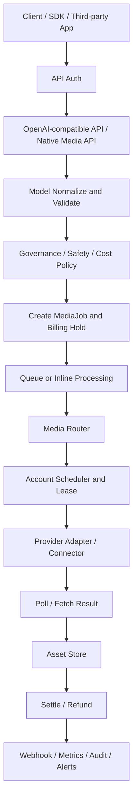

# gen2api / media2api 需求文档

文档版本：v1.2
编写日期：2026-06-09
源码基线：`ba908709353f80647036c58445d3c90c5e19c06c`，二次校准方向 `Web Cookie / Agent Provider only`
适用范围：`gen2api` 平台、`media2api` 运行包、公共 API、管理后台、Web Cookie/Agent Provider 资源接入、生产验收与后续产品演进

## 1. 文档目标

本文档基于当前仓库源码整理，并根据 2026-06-09 对 GitHub 开源社区中 `sub2api`、订阅转 API、Web 转 API、CLI/Agent 转 API、媒体生成反代 API、第三方媒体聚合器、自托管图片/视频推理项目的调研结果进行产品重定位。目标是把 `gen2api` / `media2api` 已经实现的能力、源码中隐含的产品规则、生产化缺口、以及“图片/视频生成版 sub2api 平台”的后续需求系统化沉淀下来。

本文档不是单纯复述 README，而是从以下源码区域提炼需求：

| 源码区域 | 需求依据 |
| --- | --- |
| `media2api/main.py` | FastAPI 路由、admin 控制台、报告、自检、序列化、API 编排 |
| `media2api/services_core.py` | MediaJob 运行时、模型路由、账号调度、计费、fallback、租约恢复 |
| `media2api/providers.py` | mock provider、Pollinations provider、通用 HTTP connector |
| `media2api/services_assets.py` | 资产存储、签名 URL、远程 URL 拉取、视频缩略图、SSRF 防护 |
| `media2api/services_governance.py` | API 限流、用户限额、断路器、provider/account 屏蔽 |
| `media2api/services_safety.py` | 安全策略、安全事件、拒绝规则 |
| `media2api/services_secrets.py` | 凭据加密、secret 引用、脱敏序列化 |
| `media2api/services_webhooks.py` | webhook payload、投递、重试、URL 安全校验 |
| `media2api/services_capabilities.py` | provider 能力同步、operation profile、能力快照 |
| `media2api/services_contracts.py` | provider contract test、能力一致性、账号能力校验 |
| `media2api/catalog.py` | 默认模型、provider、mock mapping、价格规则、告警规则、限额策略 |
| `media2api/provider_templates.py` | 外部 provider 模板、默认 connector 配置、映射建议 |
| `scripts/` | smoke test、acceptance audit、routing/resilience/webhook/connector 验收 |
| `examples/` | SDK 示例、reference connector |

### 1.1 本次需求校准

用户明确需求不是建设一个泛 LLM 网关，而是建设一个专注图片、视频生成结果输出的 `sub2api` 类型平台。平台应系统吸收开源社区中以下项目形态的可复用能力：

| 开源形态 | 代表方向 | 本平台需要吸收的能力 |
| --- | --- | --- |
| Web Cookie 转 API | ChatGPT Web、Grok Web、Midjourney Discord 等网页或任务通道包装 | 浏览器 cookie/session 原生接入、加密托管、账号池、健康检查、并发限制、任务状态轮询、媒体资产转存 |
| Agent Provider 转 API | Gemini CLI、Codex CLI、Qwen Code、Antigravity、Grok CLI/Build、Jimeng/Seedream Ark/ComfyUI 配置、Kling Access Key/MCP、Runway UseAPI/Agent profile 等资源转 API | Agent credential/profile 原生接入、账号轮询、隔离运行、能力探测、模型别名、失败恢复 |
| 订阅转 API | `sub2api`、Codex/ChatGPT/Gemini/Claude/Qwen Code/Grok 等订阅资源转 OpenAI-compatible API | 作为 Web Cookie 与 Agent Provider 账号池的导入格式参考：订阅清单、额度抽象、统一 API key、路由、计费 |
| 媒体任务代理 | Midjourney Proxy、Kling/Luma/Runway connector、Seedream/Seedance connector | 作为 Web Cookie 或 Agent Provider 的运行载体参考：异步任务、状态轮询、回调、取消、队列、账号并发、媒体资产转存 |
| 第三方聚合器/自托管推理 | Pollinations、OpenRouter、fal、Replicate、ComfyUI、Stable Diffusion WebUI、FLUX、Wan 等 | 非核心主线；仅作为能力对照、fallback 或 Agent Provider 后端，不作为首期账号体系中心 |

详细项目清单、支持平台、模型能力、鉴权方式和适配结论见 `docs/GitHub开源项目调研表.md`。主需求文档以该调研表作为 provider 接入优先级和 connector registry 的输入基线。

## 2. 平台定位

`gen2api` 是一个面向图片与视频生成的 Web Cookie / Agent Provider 转 API 平台。运行包名为 `media2api`，平台把图像和视频生成统一抽象为 `MediaJob`，并围绕任务运行时建立模型路由、provider 接入、账号池调度、资产存储、计费、治理、安全、审计、运维验收等平台域。

平台的产品定位可以概括为：以 Web Cookie 和 Agent Provider 为核心资源的媒体生成版 `sub2api`。它不追求成为所有聊天模型的通用入口，也不以官方 API key 聚合器为中心，而是聚焦把用户已经登录、已经授权、已经具备额度的浏览器会话和本地/远程 Agent Provider 资源，统一反代输出为稳定的图片生成、图片编辑、视频生成、视频延展 API。

平台对外提供两类接口：

1. OpenAI 兼容媒体接口，便于第三方应用快速接入。
2. 原生媒体任务接口，暴露完整任务生命周期、资产、尝试记录、事件、重试、取消、诊断等能力。

平台对上游的设计原则是：原生治理已经授权的 Web Cookie/session 与 Agent Provider credential/profile，并可通过 HTTP connector、MCP/sidecar 或本地 agent runtime 执行真实上游调用。平台允许用户录入或导入本人可用的 cookie/session/agent credential，但必须在进入系统后立即加密、脱敏、最小化使用和审计；平台不得提供绕过登录、破解验证码、规避风控、批量获取账号或窃取第三方会话的流程。

## 3. 产品目标

### 3.1 核心目标

1. 用统一 API 覆盖文生图、图生图、图片编辑、文生视频、图生视频、视频续写。
2. 将所有生成请求落为可追踪、可审计、可重试、可取消的 `MediaJob`。
3. 将调用方看到的逻辑模型与真实 provider model 解耦。
4. 根据成本、速度、质量、可靠性、账号健康和队列压力动态选择 provider。
5. 将上游账号抽象为账号池，支持并发限制、租约、配额、健康分、失败分和冷却。
6. 将生成结果统一存入平台资产库，输出平台签名 URL，而不是长期依赖上游临时 URL。
7. 支持统一 API key 认证、用户限额、安全策略、断路器、计费、webhook、审计日志和 Prometheus 指标。
8. 提供 admin 控制台和自动化验收报告，明确 core ready 与 production ready 的差异。
9. 建立开源 connector registry，跟踪 GitHub 社区中订阅转 API、Web 转 API、CLI/Agent 转 API、媒体任务代理、自托管图片/视频服务项目。
10. 将上游账号资源统一抽象为 `web_cookie_provider` 与 `agent_provider` 两类；`subscription_connector`、`web_reverse_connector`、`aggregator_connector`、`self_hosted_connector` 等只作为开源项目分类、导入来源或执行层标签。
11. 优先建设图片/视频生成专用能力矩阵，而不是复制纯文本 LLM 网关能力。
12. 对每个 Web Cookie/Agent Provider 资源及其可选执行层进行媒体能力验收，明确是否支持 T2I、I2I、Edit、T2V、I2V、Extend、取消、回调、资产转存、缩略图、并发限制和配额查询。

### 3.2 生产化目标

1. 使用 PostgreSQL 作为生产数据库。
2. 使用 Redis 承载跨进程限流与运行状态依赖。
3. 使用独立 worker 处理异步任务和恢复逻辑。
4. 配置强 bootstrap key、admin password、secret encryption key 和 asset signing secret。
5. 至少接入一个非 mock 的真实授权 mixed-media Web Cookie 或 Agent Provider 账号池。
6. 生产账号池至少覆盖：
   - `text_to_image`
   - `image_edit`
   - `text_to_video`
   - `image_to_video`
7. 通过 readiness、connector conformance、external preflight、final acceptance matrix 和 acceptance audit。

### 3.3 媒体 sub2api 专项目标

1. 将 `sub2api` 类项目中的订阅资源池、API key 分发、统一路由、成本倍率、用量统计能力，移植为图片/视频生成平台能力。
2. 将 Midjourney Proxy、Kling/Luma/Runway connector、Seedream/Seedance connector 等项目中的异步任务模型，统一纳入 `MediaJob` 状态机。
3. 将 Pollinations、OpenRouter、fal、Replicate 等聚合器的模型市场能力，统一纳入 provider template、capability sync 和 mapping 管理。
4. 将 ComfyUI、Stable Diffusion WebUI、FLUX、Wan 等自托管项目作为低成本后备 provider，补充外部订阅和网页资源不可用时的生产韧性。
5. 建立“静态开源调研表 + 动态 registry + connector conformance”的闭环，避免项目清单随 GitHub 生态变化而失效。

## 4. 关键角色

| 角色 | 核心诉求 |
| --- | --- |
| API 调用方 | 用统一 API key 调用图像/视频生成，查询任务状态，下载结果资产，接收 webhook |
| 平台管理员 | 管理用户、API key、模型、provider、账号池、价格、安全策略、告警、验收报告 |
| Connector 运维方 | 提供已授权 HTTP sidecar，暴露 health、capabilities、quota、submit、poll、cancel |
| 订阅/资源提供方 | 提供已授权的订阅资源、账号资源、CLI/Agent 资源、第三方聚合器账号或自托管推理端点 |
| 开源 connector 适配开发者 | 根据 GitHub 调研表，把可用项目包装成符合 gen2api contract 的 connector |
| 财务/运营人员 | 查看用量、成本、发票、异常消耗、高成本任务和 provider 成本记录 |
| 安全/合规人员 | 审查凭据脱敏、SSRF 防护、审计日志、安全策略、上游接入边界 |

## 5. 核心概念

### 5.1 Logical Model

逻辑模型是 API 调用方使用的模型名。当前默认模型包括：

- `t2i-fast`
- `t2i-pro`
- `image-edit`
- `image-variation`
- `i2v-fast`
- `i2v-pro`
- `t2v-general`
- `video-extend`

每个逻辑模型定义支持的 operation、默认参数、约束和 billing class。

### 5.2 Operation

平台标准化支持以下媒体操作：

- `text_to_image`
- `image_to_image`
- `image_edit`
- `text_to_video`
- `image_to_video`
- `video_extend`

### 5.3 Provider

Provider 表示上游资源、聚合器或 connector 类型。源码内置模板覆盖：

- `mock`
- `openai_image`
- `gemini`
- `grok`
- `qwen`
- `jimeng`
- `kling`
- `luma`
- `runway`
- `midjourney`
- `pollinations`
- `openrouter_image`
- `fal_replicate`
- `seedream_proxy`
- `amux_qwen`
- `flux_stability`

### 5.4 Provider Model Mapping

Provider model mapping 将逻辑模型映射到真实 provider model，并声明：

- 支持的 operation
- priority
- weight
- cost score
- speed score
- quality score
- reliability score
- enabled 状态

### 5.5 Account Resource

Account resource 表示 provider 下可调度的账号、订阅、连接器资源或账号池入口。

账号资源需要声明：

- `credential_ref`
- 支持的 operations
- 支持的 provider models
- quota buckets
- concurrency limit
- current leases
- health score
- failure score
- status
- last error

### 5.6 MediaJob

`MediaJob` 是平台最核心的任务实体。所有图片和视频生成都会被统一写入任务表。

任务记录：

- user id
- api key id
- operation
- logical model
- normalized params
- input asset ids
- output asset ids
- provider id
- provider model
- account id
- provider task id
- status
- cost estimate
- final cost
- error code
- error message

### 5.7 MediaAsset

`MediaAsset` 是平台资产实体。输入图、mask、视频、生成结果、缩略图都会入库为资产。

资产能力包括：

- 本地存储
- S3 兼容存储
- HMAC 签名临时 URL
- 图片元数据校验
- 视频元数据探测
- 视频缩略图生成
- 远程 URL 拉取安全校验

### 5.8 Connector

Connector 是已经授权的外部 HTTP/MCP sidecar。它负责真实上游调用，平台负责调度、参数翻译、资产入库、计费、审计和验收。

建议最小接口：

- `GET /health`
- `GET /capabilities`
- `GET /quota`
- `POST /v1/images/generations`
- `POST /v1/images/edits`
- `POST /v1/videos/generations`
- `GET /tasks/{task_id}`
- `POST /tasks/{task_id}/cancel`

### 5.9 Authorized Resource

Authorized resource 表示可被转换为 API 产能的已授权账号资源。它不是上游第一方 API key，也不是一个泛化 connector 地址，而是 Web Cookie/session 或 Agent Provider credential/profile 两类资源之一。

资源来源包括：

- ChatGPT/Codex 订阅或 Codex CLI 资源。
- Gemini/Antigravity/Gemini CLI 资源。
- Grok Web/Build/CLI 资源。
- Qwen Code、Claude Code、Kiro 等客户端资源。
- Midjourney Discord 任务通道资源。
- Jimeng/Seedream、Kling、Luma、Runway 等 Agent Provider、MCP、UseAPI 或受托管任务平台资源。
- 第三方聚合器账号或自托管推理资源只能作为 Agent Provider 后端、fallback 或执行层材料，例如 Pollinations、OpenRouter、fal、Replicate、ComfyUI、Stable Diffusion WebUI、FLUX、Wan 本地服务。

### 5.10 Resource Auth Type

上游资源鉴权方式需要统一抽象，不直接暴露敏感值。

| 鉴权类型 | 含义 | 存储要求 |
| --- | --- | --- |
| `cookie_secret` | 平台加密保存的浏览器 cookie、cookie jar、session token、Discord/MJ 任务通道 session | Web Cookie 核心路径；必须绑定 provider、账号、域名 allowlist、过期时间、风险等级和轮换策略 |
| `agent_provider_credential` | Agent Provider 的本地配置、profile、credential cache、MCP config、runner profile 或 `agent://...` 引用 | Agent Provider 核心路径；必须绑定 runtime、工作目录、并发、健康检查和密钥空间 |
| 兼容导入字段 | `oauth_reference`、`cli_credential_reference`、`mcp_config_reference`、`token_reference`、`subscription_url`、`self_hosted_endpoint` 等旧格式 | 只能作为导入来源字段，入库后必须归一到 `cookie_secret` 或 `agent_provider_credential`，不得在产品主路径中作为独立账号类型展示 |

### 5.11 Open Source Connector Registry

Open source connector registry 是平台维护 GitHub 开源生态项目的目录。它将静态调研转化为可管理的 provider 接入计划。

每个 registry item 至少记录：

- GitHub 仓库地址。
- 项目类型：`subscription_connector`、`web_reverse`、`agent_connector`、`aggregator_connector`、`self_hosted_connector`、`mcp_connector`。
- 支持平台。
- 支持模型和 operation。
- 上游鉴权方式。
- 下游鉴权方式。
- 风险等级。
- 最近提交时间和维护状态。
- license。
- 是否已适配 gen2api connector contract。
- 是否通过 conformance、external acceptance 和生产验收。

### 5.12 Media Reverse Proxy

Media reverse proxy 是本平台的核心产品形态。它把上游多种资源统一转换为以下稳定输出：

- OpenAI-compatible 图片生成接口。
- OpenAI-compatible 图片编辑接口。
- 原生视频生成任务接口。
- 原生视频延展任务接口。
- 统一 `MediaJob` 查询接口。
- 统一 `MediaAsset` 下载接口。
- webhook 与回调接口。

反代层必须屏蔽不同上游的任务状态、临时 URL、按钮动作、排队机制、失败码、配额字段差异，并输出平台统一语义。

## 6. 总体架构需求

平台应维持以下分层：



架构约束：

1. OpenAI 兼容接口只是外部兼容层，不应主导内部领域模型。
2. 图像和视频任务必须共享同一个 `MediaJob` 状态机。
3. 模型、provider、provider model、账号资源必须分离。
4. provider 输出必须入库为平台资产。
5. 敏感凭据必须以 `secret://` 或 `agent://` 等受控输入路径引用；`env://`、`public://` 仅用于兼容配置和非敏感公开资源，不作为新账号接入方式。
6. admin 报告必须能明确指出生产阻塞项。

## 7. 功能需求

### 7.1 认证与用户

已实现：

1. 公共 API 和 admin API 使用统一 API key。
2. API key 以 SHA-256 hash 存储。
3. 支持 `Authorization: Bearer <key>` 和 `x-api-key`。
4. admin 页面支持登录，并通过 HttpOnly cookie 调用 admin API。
5. 管理员通过 admin tier 或固定 admin 用户识别。
6. 禁用用户或禁用 API key 不可访问。

扩展：

1. API key 创建后明文只显示一次。
2. API key 支持过期时间、IP allowlist、最后使用时间。
3. admin 支持细粒度 RBAC，例如只读运维、财务、provider 管理员。
4. 支持 SSO/OIDC，同时保留 bootstrap admin 作为紧急入口。

### 7.2 OpenAI 兼容媒体 API

已实现：

| 接口 | 说明 |
| --- | --- |
| `GET /v1/models` | 返回逻辑模型列表 |
| `POST /v1/images/generations` | 文生图，同步处理并返回图片结果 |
| `POST /v1/images/edits` | 图片编辑/图生图，同步处理并返回图片结果 |
| `POST /v1/videos/generations` | 创建视频任务 |
| `GET /v1/videos/generations/{job_id}` | 查询视频任务 |

图片生成参数应支持：

- `model`
- `prompt`
- `size`
- `n`
- `quality`
- `seed`
- `negative_prompt`
- `response_format`
- `route_policy`
- `provider_preference`
- `provider_model`
- `excluded_providers`

视频生成参数应支持：

- `model`
- `prompt`
- `image`
- `first_frame`
- `last_frame`
- `duration`
- `aspect_ratio`
- `quality`
- `seed`
- `negative_prompt`
- `webhook`
- 路由偏好参数

扩展：

1. 图片同步接口超过超时时间后自动降级为异步任务。
2. 增加更多 OpenAI 兼容字段，如 revised prompt、usage。
3. 图片编辑支持 multipart 输入而不仅限平台 asset id 或 URL。

### 7.3 原生 MediaJob API

已实现：

| 接口 | 说明 |
| --- | --- |
| `POST /v1/media-jobs` | 创建原生媒体任务 |
| `GET /v1/media-jobs/{job_id}` | 查询任务详情 |
| `GET /v1/media-jobs/{job_id}/attempts` | 查询 provider 尝试记录 |
| `GET /v1/media-jobs/{job_id}/events` | 查询任务事件 |
| `POST /v1/media-jobs/{job_id}/retry` | 重试失败、取消或过期任务 |
| `POST /v1/media-jobs/{job_id}/cancel` | 取消任务 |

任务状态应覆盖：

- `created`
- `admitted`
- `queued`
- `leasing_account`
- `preparing_assets`
- `submitting`
- `provider_queued`
- `polling`
- `fetching_assets`
- `storing`
- `completed`
- `failed`
- `cancelled`
- `expired`

扩展：

1. 支持幂等键，避免客户端重复提交。
2. 支持批量任务。
3. 支持任务优先级动态调整。
4. 支持多步骤媒体工作流。

### 7.4 模型注册与参数校验

已实现：

1. 默认种子数据创建逻辑模型。
2. 每个模型声明支持 operation。
3. 每个模型包含默认参数和约束。
4. 请求进入运行时先 normalize and validate。
5. 校验 prompt 长度、`n`、视频时长、质量、尺寸、宽高比、输入资产数量。

扩展：

1. 模型配置版本化。
2. 按用户 tier 覆盖模型约束。
3. 基于 provider capabilities 自动生成参数表单。
4. 模型别名、废弃和迁移策略。

### 7.5 路由与 Provider 选择

已实现：

1. 根据 logical model、operation 和 mapping 查询候选 provider。
2. 只选择 active provider 和 enabled mapping。
3. 支持 provider include、provider preference、provider model、excluded providers。
4. 普通用户账号定向参数会被清洗，管理员可以使用账号定向。
5. 支持路由策略：
   - `balanced`
   - `lowest_cost`
   - `fastest`
   - `best_quality`
6. 评分因素包括 priority、成本、速度、质量、可靠性、近期成功率、账号健康、账号负载、provider 队列长度。
7. provider 失败后 fallback 到下一个候选。
8. 成功或失败后动态调整 mapping reliability score。

扩展：

1. 引入 weighted random，避免永远选择第一候选。
2. 引入实际延迟分位数、实际成本和质量反馈。
3. 提供路由解释 API。
4. 支持 canary routing 和 A/B test。

### 7.6 账号池与租约

已实现：

1. 每个 provider 可配置多个 account resource。
2. 账号声明支持的 operations 和 provider models。
3. 账号有 concurrency limit 和 current leases。
4. 调度时只选择 active、未超并发、credential 可用、quota 可用、未被 breaker 阻断的账号。
5. 获取账号时创建 `AccountLease`。
6. 任务成功、失败、取消、过期后释放租约。
7. 成功后提升健康分、降低失败分。
8. 失败后提高失败分、降低健康分，并可进入 `rate_limited`、`auth_required`、`quota_exhausted`、`cooldown`。
9. 支持租约过期扫描。
10. 支持终态任务租约 reconcile。

扩展：

1. 账号权重、成本标签、地域标签。
2. 账号池容量预测和扩容建议。
3. cooldown 自动恢复探测。
4. 分布式锁或更严格的数据库并发控制。

### 7.7 Provider Adapter 与 Connector

已实现：

1. `mock` provider 用于本地确定性测试。
2. `pollinations` provider 作为聚合器适配器。
3. 其他 provider 通过通用 `ConnectorProvider` 接入。
4. Connector 仅在对应开源项目明确要求外部 sidecar/runner 服务地址时，通过 `base_config.base_url` 配置执行器根地址；Web Cookie / Agent Provider 资源本身不要求用户填写通用 base URL。
5. Connector 支持自定义 submit、poll、cancel、quota、health、capability endpoint。
6. Connector 请求支持 Authorization 或自定义 header。
7. 输入资产 ID 会被替换为平台签名 URL。
8. Connector 输出支持 URL、相对 URL、base64、data URI、asset_id。
9. 输出资产会被平台下载或解码后入库。
10. Connector 错误会标准化为平台错误码。
11. Connector submit payload 必须携带 `provider_id`、`operation`、`account.id`、`account.credential_ref`、账号支持的 operations 和 provider models，便于外部 sidecar 选择正确的 Web Cookie/session 或 Agent Provider profile。

错误码要求：

| 错误码 | 含义 |
| --- | --- |
| `PROVIDER_TIMEOUT` | provider 或 connector 超时 |
| `AUTH_REQUIRED` | 账号授权失效或凭据错误 |
| `QUOTA_EXHAUSTED` | 配额不足 |
| `RATE_LIMITED` | 上游限流 |
| `PROVIDER_CONFIG_INVALID` | provider 配置错误 |
| `PROVIDER_FAILED` | 其他 provider 失败 |

Connector 合同要求：

1. `GET /health` 返回健康状态。
2. `GET /capabilities` 返回 operations、models、operation capabilities。
3. quota endpoint 返回 quota buckets。
4. submit 接口接受 `model`、`prompt`、媒体参数和平台资产 URL。
5. 同步完成时返回可入库 outputs。
6. 异步任务返回 task id，并通过 poll endpoint 返回状态和输出。
7. cancel endpoint 可选，未配置时返回 not supported。
8. 响应不得包含明文敏感凭据。

扩展：

1. 提供正式 OpenAPI connector schema。
2. 提供 connector SDK。
3. 支持 connector 动态注册。
4. 支持 connector 多账号能力上报。

### 7.8 资产系统

已实现：

1. `POST /v1/assets` 支持 multipart 上传。
2. `POST /v1/assets` 支持 JSON base64 上传。
3. `POST /v1/assets` 支持远程 URL 拉取。
4. `GET /v1/assets` 支持列表查询。
5. `GET /v1/assets/{asset_id}` 查询元数据。
6. `GET /v1/assets/{asset_id}/content` 使用签名参数下载内容。
7. `DELETE /v1/assets/{asset_id}` 删除资产。
8. 支持本地存储和 S3 兼容存储。
9. 图片校验 mime、宽高、像素上限。
10. 视频使用 ffprobe 探测宽高和时长。
11. 视频资产自动生成 thumbnail asset。
12. 远程 URL 拉取默认禁止私有地址，支持 allowed hosts 和 redirect 限制。
13. 资产公开 URL 使用 HMAC 签名和过期时间。

扩展：

1. 资产生命周期和自动清理。
2. MIME magic number 校验。
3. 内容安全扫描。
4. CDN 签名 URL。
5. 资产去重和引用计数。

### 7.9 计费与成本

已实现：

1. PricingRule 定义价格。
2. 按 logical model、billing class、operation 匹配最具体规则。
3. 支持计费单位 image、second、task。
4. 支持 base amount、unit amount、input asset amount。
5. 支持 provider cost 估算。
6. 支持 quality multiplier。
7. 创建任务时估算成本。
8. 创建任务时检查 wallet balance。
9. 创建任务时创建 BillingHold 并扣减余额。
10. 成功后 settle，写 UsageRecord 和 ProviderCostRecord。
11. 失败、取消、过期后 refund。
12. 支持 `max_cost`、`max_credits` 等成本策略。
13. 支持 usage、summary、invoice、billing holds、provider costs 查询。

扩展：

1. 多币种与真实支付账单。
2. 成本中心、项目、标签维度。
3. 月度预算和预算告警。
4. provider 实际成本回填。
5. 对账和退款原因分类。

### 7.10 治理、限流与断路器

已实现：

1. UserLimitPolicy 支持 RPM、daily job limit、concurrent job limit。
2. 支持 allowed models。
3. 支持 high cost models 与 high cost allowed。
4. Redis 配置存在时使用 Redis 计数。
5. Redis 未配置或失败时使用进程内窗口。
6. 支持 user、model、provider、account 断路器。
7. provider 错误可自动打开 account 或 provider breaker。

扩展：

1. 令牌桶或滑动窗口限流。
2. 租户级全局限流。
3. provider 级队列限流。
4. breaker 自动恢复健康探测。
5. breaker 手动操作审计。

### 7.11 安全策略

已实现：

1. SafetyPolicy 支持 global、model、operation 范围。
2. 支持 term 和 regex 匹配。
3. 支持 reject 或 log。
4. 命中后写 SafetyEvent。
5. reject 抛出 `SAFETY_REJECTED` 并触发告警。
6. 默认内置 narrow smoke-test marker。

扩展：

1. 输入图片安全检测。
2. 生成结果安全复检。
3. 策略版本与审批。
4. 人工审核队列。
5. 区域合规策略集。

### 7.12 凭据与秘密管理

已实现：

1. CredentialSecret 使用 Fernet 加密。
2. 加密密钥来自 `MEDIA2API_SECRET_ENCRYPTION_KEY`。
3. 产品主路径只暴露 `cookie_secret` 与 `agent_provider_credential` 两类凭据；底层 secret kind 可保留少量兼容值用于导入迁移，但不得把上游 API key、bearer token 作为账号资源类型展示。
4. secret 支持 active/disabled。
5. 序列化只返回 preview、fingerprint、ref，不返回明文。
6. 用户可见的安全引用以 `secret://` 和 `agent://` 为主；`env://`、`plain://`、`bearer://` 等只能作为历史配置兼容输入或测试夹具，不进入新接入指南。
7. 账号 onboarding 可把一次性提交的 cookie/session 或 agent profile 材料迁移成 encrypted secret。
8. 已托管的 `secret://...` 必须按真实 `secret.kind` 校验资源类型，Cookie secret 不能绑定 Agent Provider，Agent Provider secret 不能绑定 Web Cookie Provider。
9. 配置导出和审计日志对敏感字段脱敏。

生产约束：

1. 必须设置强 `MEDIA2API_SECRET_ENCRYPTION_KEY`。
2. 不应使用默认 bootstrap key 作为资产签名密钥。
3. 上游账号材料必须使用 secret 或 env reference。

扩展：

1. KMS、Vault 或云 Secret Manager。
2. secret rotation。
3. secret 使用审计。
4. provider/account scoped secret。

### 7.13 Webhook

已实现：

1. 任务参数支持 `webhook` 或 `webhook_url`。
2. 任务终态后创建 WebhookDelivery。
3. payload 包含任务状态、模型、provider、错误、输出资产 URL 和成本。
4. 支持最大尝试次数和重试间隔。
5. webhook URL 默认禁止私有地址，支持 allowed hosts。
6. 支持用户和 admin 查询 webhook。
7. 支持重试失败 webhook。

扩展：

1. webhook 签名。
2. 事件订阅。
3. 异步投递队列。
4. 死信队列。
5. 投递成功率和延迟指标。

### 7.14 Admin 控制台与管理 API

已实现能力包括：

1. dashboard 总览。
2. 用户管理。
3. API key 管理。
4. credential secrets 管理。
5. logical models 管理。
6. providers 管理。
7. accounts 管理。
8. model mappings 管理。
9. router preview。
10. jobs、attempts、events、diagnostics。
11. assets 管理。
12. billing usage、pricing rules、holds、invoices。
13. webhooks 管理。
14. alerts 和 anomaly scan。
15. safety policies 和 safety events。
16. request logs。
17. provider health check。
18. capability sync。
19. quota sync。
20. provider contract tests。
21. provider templates install/activate。
22. external acceptance。
23. account onboarding 和 bulk onboarding。
24. compatibility matrix。
25. config export/import。
26. readiness、acceptance report、system requirements report、final acceptance matrix、delivery package。

扩展：

1. 将服务端 HTML admin 升级为独立前端。
2. 增加搜索、筛选、批量操作、差异对比。
3. 增加 admin 操作审计。
4. 增加审批流。
5. 增加 connector onboarding wizard 的联机测试引导。

### 7.15 观测、审计与告警

已实现：

1. 每个请求生成或继承 `x-request-id`。
2. JSON 响应被审计，用于提取 job id 和 error code。
3. RequestAuditLog 记录 request、user、api key、job、attempt、provider、account、model、task、error、client、user agent。
4. query string 对敏感参数脱敏。
5. `/metrics` 输出 Prometheus 指标。
6. 指标包含任务总数、任务耗时、provider 错误、poll timeout、账号租约、失败分、资产入库失败、billing holds、fallback、stalled job 等。
7. AlertService 支持账号状态、任务失败、provider health、高成本任务、安全拒绝、断路器、用量异常。

扩展：

1. OpenTelemetry trace。
2. 日志输出到外部日志系统。
3. 指标 label cardinality 控制。
4. 审计日志 retention 和归档。
5. SLO dashboard。

### 7.16 报告与验收

已实现报告：

| 接口 | 说明 |
| --- | --- |
| `/v1/admin/readiness` | 核心与生产就绪检查 |
| `/v1/admin/acceptance-report` | 验收报告 |
| `/v1/admin/provider-onboarding-report` | provider 接入报告 |
| `/v1/admin/operator-workbench-report` | 运维工作台报告 |
| `/v1/admin/production-go-live-plan` | 生产上线计划 |
| `/v1/admin/connector-conformance-report` | connector 一致性报告 |
| `/v1/admin/external-connector-preflight` | 外部连接器预检 |
| `/v1/admin/connector-registry` | 本地开源连接器仓库分类清单 |
| `/v1/admin/connector-registry/refresh` | 扫描 `res-repo/` 并刷新 connector registry |
| `/v1/admin/account-guides` | 按 provider 输出账号添加指南 |
| `/v1/admin/account-guides/{provider_id}` | 单个平台账号添加指南 |
| `/v1/admin/platform-input-requirements` | 按 provider 输出对应开源项目实际要求用户填写的 Web Cookie / Agent Provider 字段；执行器地址仅在项目要求时出现 |
| `/v1/admin/account-onboarding/plan` | 根据 provider、鉴权方式和引用生成账号接入计划 |
| `/v1/admin/authorized-resource-sessions` | 授权资源会话主入口，用于 delegated OAuth、Web session assist 或 Agent Provider 授权助手 |
| `/v1/admin/authorized-resource-sessions/{session_id}` | 查询单个授权会话状态 |
| `/v1/admin/authorized-resource-sessions/{session_id}/complete` | 从授权助手回收 `credential_ref` 并可自动创建账号 |
| `/v1/admin/oauth-sessions` | 历史兼容路径；产品语义仍是授权资源会话，不作为独立 OAuth 账号类型 |
| `/v1/admin/account-subscriptions/preview` | 兼容旧路径名：预览 connector/sub2api 资源清单、JSON 数组、JSONL 或 accounts/resources/items 包装对象将生成的 Web Cookie / Agent Provider 账号资源 |
| `/v1/admin/account-subscriptions/import` | 兼容旧路径名：将预览通过的资源清单批量导入账号池，并逐条复用 account onboarding 写入流程 |
| `/v1/admin/account-subscription-sources` | 兼容旧路径名：管理长期资源清单源，支持列表和创建 |
| `/v1/admin/account-subscription-sources/{source_id}` | 查看或更新单个长期资源清单源 |
| `/v1/admin/account-subscription-sources/{source_id}/sync` | 对长期资源清单源执行预览同步或正式同步 |
| `/v1/admin/account-subscription-sources/{source_id}/production-sync` | 对资源清单源执行生产化预演/同步，串联账号导入、能力同步、健康检查、额度同步、connector preflight 和可选账号验收 |
| `/v1/admin/system-requirements-report` | 系统需求满足情况 |
| `/v1/admin/final-acceptance-matrix` | 最终验收矩阵 |
| `/v1/admin/delivery-package` | 交付包 |

Core ready 条件：

1. 数据库可查询。
2. 逻辑模型数量达标。
3. 操作覆盖达标。
4. 至少一个 active provider。
5. enabled mapping 数量达标。
6. mock provider/account/mapping 可用。
7. pricing rules 达标。

Production ready 条件：

1. 数据库 backend 为 PostgreSQL。
2. 队列 backend 为 database-worker。
3. Redis 已配置且可用。
4. 存在可用的非 mock external connector account。
5. 存在覆盖关键图像和视频操作的 external mixed media provider/account。

扩展：

1. 报告导出 Markdown、PDF、CSV。
2. 报告历史快照。
3. readiness 定时监控。
4. 生产变更前后对比报告。

### 7.17 开源生态雷达与 Connector Registry

新增需求：

1. 平台应在 `docs/GitHub开源项目调研表.md` 的基础上建立可维护的 connector registry。
2. Registry 应覆盖订阅转 API、Web 转 API、CLI/Agent 转 API、媒体任务代理、第三方媒体聚合器、自托管图片/视频推理服务。
3. 每个项目必须记录 GitHub 地址、项目类型、支持平台、支持模型、支持 operation、上游鉴权方式、下游鉴权方式、风险等级、license、维护状态、最近提交时间。
4. Registry 应支持按源码 provider 过滤，例如 `openai_image`、`gemini`、`grok`、`qwen`、`jimeng`、`kling`、`luma`、`runway`、`midjourney`、`pollinations`、`openrouter_image`、`fal_replicate`、`seedream_proxy`、`amux_qwen`、`flux_stability`。
5. Registry 应支持接入状态：`discovered`、`shortlisted`、`adapter_designing`、`connector_ready`、`conformance_passed`、`external_acceptance_passed`、`production_enabled`、`deprecated`。
6. Registry 应支持风险标签：`official_api`、`third_party_aggregator`、`subscription_connector`、`web_reverse`、`agent_connector`、`mcp_connector`、`self_hosted`、`high_risk_unofficial`。
7. Admin 控制台应展示项目到 provider template 的映射关系，并允许生成 connector onboarding checklist。
8. 每月至少刷新一次 registry，更新仓库可访问性、维护状态、模型能力和风险评级。

### 7.18 Web Cookie / Agent Provider 资源接入

新增需求：

1. AccountResource 的资源本体只应归一为两类：`web_cookie_provider` 与 `agent_provider`。`web_reverse_connector`、`agent_connector`、`mcp_connector`、`subscription_import` 等只能作为开源项目分类、导入来源或执行层画像，不应成为账号资源主类型。
2. 资源接入表单必须支持 Web Cookie/session 原生导入：粘贴 cookie header、JSON cookie jar、浏览器导出片段或 `secret://...` 引用；明文只能用于一次性提交，入库后必须转成 encrypted secret/ref。
3. 资源接入表单必须支持 Agent Provider 原生导入：CLI/Agent profile、credential cache、agent config、MCP server config、agent runtime endpoint、工作目录和隔离策略，统一使用 `agent_provider_credential`。
4. 资源接入表单只暴露 `cookie_secret` 与 `agent_provider_credential` 两类鉴权；旧的 `subscription_url`、`token_reference`、OAuth/CLI/MCP 字段只能在批量导入时兼容解析，并且入库后必须归一到两类资源。表单字段必须来自 provider 的 `input_requirements`：平台专属字段动态展示并进入 `resource_profile`，connector/runner base URL 只有在对应开源项目明确要求服务地址时才展示或要求填写，并且只属于执行层。API 层也必须校验该规则，对没有 runner/sidecar/runtime endpoint 要求的平台拒绝 `provider_base_url`；验收时必须通过 `/v1/admin/platform-input-conformance` 查看每个平台的 `credential_input_fields`、`dynamic_profile_fields` 与 `runtime_base_url_allowed`。
5. 资源接入可提供 sub2api 式批量导入：支持资源清单 URL、JSON 数组、JSONL，以及 `accounts` / `resources` / `items` / `data` 包装对象；导入结果必须是 Web Cookie 或 Agent Provider。
6. 批量导入应先提供 preview，展示将创建的账号、凭据模式、模型能力、warnings 和失败项；确认后再导入。
7. 生产环境可支持长期资源源：保存 provider、资源类型、资源清单 URL 或持久化内容、可选执行器地址、默认 operations/models、默认并发、区域、套餐、cookie 过期时间、agent profile 和同步策略。
8. 长期资源源应支持 dry-run preview 和正式 sync，最近一次同步状态、错误、summary 和预览摘要必须可查询。
9. 长期资源源应提供 production-sync：串联账号导入、能力同步、健康检查、额度同步、connector preflight，并可选运行账号验收和真实样本。
10. production-sync 默认应支持 dry-run，避免误消耗上游额度；真实样本验收必须由操作者显式开启。
11. 导入和资源源同步流程必须复用单账号 onboarding，不绕过鉴权类型校验、凭据引用规范化、cookie/agent secret 加密、provider 默认模型能力补齐和账号验收路径。
12. 对 Codex/ChatGPT/Gemini/Qwen/Grok、Jimeng/Seedream、Kling、Runway、Luma 等 Agent Provider 资源，主平台必须能原生登记 agent profile、credential reference、runtime、隔离策略和健康检查；外部 sidecar 是可选执行层，不是唯一承载方式。
13. 对 ChatGPT、Grok、Midjourney 等 Web/任务通道资源，主平台必须能原生管理 Web Cookie/session secret、账号状态、过期时间、域名 allowlist、并发和冷却；connector 负责执行网页任务时，仍由主平台保存资源画像和调度事实。
14. 资源必须声明并发上限、冷却策略、日额度、月额度、单任务最大成本、最大视频时长、最大参考图数量。
15. 资源必须支持健康检查；无法支持 health endpoint 的资源不得进入 production route。
16. 资源状态至少包括 `active`、`disabled`、`auth_required`、`quota_exhausted`、`rate_limited`、`cooldown`、`degraded`。
17. 资源进入 production 前必须通过 connector conformance、capability sync、quota check、至少一条真实样本任务验收。

### 7.19 图片生成与编辑反代 API

新增需求：

1. 平台应优先保证 `text_to_image`、`image_to_image`、`image_edit` 三类图片能力稳定输出。
2. 图片接口需要兼容 OpenAI `POST /v1/images/generations` 和 `POST /v1/images/edits`，同时保留原生 `MediaJob` 接口。
3. 图片 provider 应覆盖以下来源：
   - `openai_image`：ChatGPT/Codex 图像订阅或 sidecar，目标 `gpt-image-2`、`codex-gpt-image-2`。
   - `gemini`：Nano Banana、Nano Banana Pro、Imagen。
   - `grok`：Grok Imagine Image。
   - `qwen` / `amux_qwen`：Qwen Image、Qwen Image Edit、Wan Image。
   - `jimeng` / `seedream_proxy`：Seedream、Seededit。
   - `midjourney`：V6、V7、Niji、variation、blend、describe。
   - `pollinations`、`openrouter_image`、`fal_replicate`：第三方聚合图片模型。
   - `flux_stability`：ComfyUI、FLUX、SDXL、Stable Image、ControlNet。
4. 图片标准参数至少包含 prompt、negative prompt、size/aspect ratio、quality、style、seed、n、response_format、reference images、mask、strength、background、watermark preference。
5. 不同上游的图片结果必须统一转存为 `MediaAsset`，输出平台签名 URL 或 b64。
6. Midjourney 类 provider 的 upscale、variation、reroll、blend、describe 应统一为平台 action 或 `image_to_image` 子能力。
7. 图片 provider 必须输出宽高、mime type、文件大小、hash、生成耗时、provider task id。
8. 图片结果需要支持失败重试、fallback 到同级逻辑模型、成本结算和安全审计。

### 7.20 视频生成与延展反代 API

新增需求：

1. 平台应优先保证 `text_to_video`、`image_to_video`、`video_extend` 三类视频能力稳定输出。
2. 视频接口需要保留原生异步 `MediaJob` 语义；OpenAI-compatible video endpoint 可以作为兼容层，但不应牺牲任务状态细节。
3. 视频 provider 应覆盖以下来源：
   - `gemini`：Veo 3.x。
   - `grok`：Grok Imagine Video。
   - `qwen`：Qwen Video、Wan Video。
   - `jimeng`：Seedance T2V/I2V。
   - `kling`：Kling T2V、I2V、Extend。
   - `luma`：Dream Machine、Luma Ray、Extend。
   - `runway`：Gen-3、Gen-4、Extend。
   - `pollinations`、`fal_replicate`：聚合视频模型。
   - 扩展候选：Sora、Hailuo/MiniMax、Pika、Pixverse。
4. 视频标准参数至少包含 prompt、negative prompt、first_frame、last_frame、reference images、duration、aspect ratio、resolution、fps、camera/motion、style、seed、loop、extend_from、webhook。
5. 视频任务必须支持长轮询、超时、取消、恢复、stalled job 检测和任务幂等。
6. 视频输出必须转存为 `MediaAsset`，生成缩略图，并保存 duration、width、height、fps、codec、mime type、文件大小。
7. 视频计费应支持按任务、按秒、按分辨率、按模型质量档、按重试成本计算。
8. 视频 fallback 必须尊重能力差异，例如 I2V 不能 fallback 到仅支持 T2V 的 provider，Extend 不能 fallback 到不支持 video input 的 provider。

### 7.21 第三方聚合器与自托管后备

新增需求：

1. `pollinations`、`openrouter_image`、`fal_replicate`、useapi/Kie/Nexior 等聚合器必须作为 aggregator adapter 分层治理，不应与 Web 账号池 provider 混用。
2. 聚合器 provider 必须支持模型能力动态同步，至少同步模型名、operation、价格或成本估计、最大时长、最大参考图、是否异步、是否支持取消。
3. 聚合器账号必须有独立预算、单日上限、失败率断路器和账单核对字段。
4. ComfyUI、Stable Diffusion WebUI、FLUX、Wan2GP 等自托管资源不作为首期账号资源主线；需要接入时应作为 `agent_provider` 的后端/runner 或明确标记为 fallback 执行层。
5. 自托管 connector 必须声明 GPU 队列、最大并发、模型文件版本、工作流模板、显存需求、冷启动时间。
6. 自托管输出也必须走统一资产、计费、审计、webhook 和验收流程。
7. 当外部订阅/Web/聚合资源不可用时，自托管 provider 可作为降级后备，但必须在响应中保留实际 provider 和 provider model 信息。

### 7.22 MCP-to-HTTP Sidecar

新增需求：

1. 对 Kling、Luma、MiniMax/Hailuo、Grok、MeiGen、ComfyUI 等 MCP 项目，平台应支持通过 MCP-to-HTTP sidecar 转换为标准 connector。
2. MCP sidecar 应暴露与 HTTP connector 一致的 health、capabilities、quota、submit、poll、cancel 能力。
3. MCP 工具调用结果必须转为平台标准 `MediaJob` 和 `MediaAsset`。
4. MCP 配置和 token 必须作为 `mcp_config_reference` 进入 vault，不在 admin 页面明文展示。
5. MCP connector 必须通过与 HTTP connector 相同的 conformance suite。

### 7.23 媒体 Connector 验收矩阵

新增需求：

| 验收项 | 必填说明 |
| --- | --- |
| `operations` | 明确支持 T2I/I2I/Edit/T2V/I2V/Extend 中哪些能力 |
| `models` | 真实 provider model 列表和别名 |
| `auth_type` | 只允许归一为 `cookie_secret` 或 `agent_provider_credential`；`oauth_reference`、`cli_credential_reference`、`mcp_config_reference`、`subscription_url`、`self_hosted_endpoint` 等只能作为兼容导入字段或执行层来源说明 |
| `quota` | 剩余额度、重置时间、日/月上限、单任务上限 |
| `queue` | 是否异步、最大排队时长、最大并发、冷却策略 |
| `asset_output` | 是否返回稳定 URL、是否需要平台转存、是否支持 b64 |
| `callbacks` | 是否支持 webhook/callback，不支持时必须支持 poll |
| `cancel` | 是否支持取消，不支持时平台如何标记和退款 |
| `cost` | 单图、单秒、分辨率、质量档、重试成本 |
| `safety` | 是否有上游安全拒绝码，如何映射为平台错误码 |
| `acceptance_sample` | 每个 operation 至少一条真实样本任务，通过后才能生产启用 |

## 8. 非功能需求

### 8.1 安全性

1. 所有公共和管理 API 必须认证。
2. API key 必须 hash 存储。
3. provider credentials 必须引用或加密存储。
4. admin/config export/report 不得泄露凭据明文。
5. request audit query string 必须脱敏。
6. 远程资产拉取默认禁止私有地址。
7. webhook 默认禁止私有地址。
8. 资产 URL 必须签名并过期。
9. 生产环境必须替换所有默认密钥。
10. 平台必须支持 Web Cookie/session 的原生录入、加密托管、轮换、脱敏展示和审计，但不得提供绕过登录、破解验证码、规避风控、批量获取账号或窃取第三方会话的能力。
11. 所有 GitHub 开源 connector/agent 项目必须标注风险等级，`high_risk_unofficial` 不得直接进入生产路由。
12. Web Cookie 与 Agent Provider 授权材料可以由主平台 secret/vault 原生托管，也可以停留在外部 sidecar 或 vault 中；无论哪种方式，报告、日志、错误信息不得出现明文。

### 8.2 可用性

1. worker 应定期恢复停滞任务。
2. worker 应定期清理过期租约。
3. provider 失败应触发 fallback。
4. provider/account 错误应进入断路器或冷却。
5. 失败、取消、过期任务应退还 billing hold。
6. webhook 失败应可重试。
7. 任务事件应足够支持诊断。

### 8.3 可扩展性

1. 新 provider 应通过模板或通用 connector 接入。
2. 新模型应通过 logical model 和 provider model mapping 接入。
3. 新操作应扩展 operation capabilities、模型约束、计费规则、connector contract。
4. 资产存储应可从本地切换到 S3。
5. 限流应可从进程内切换到 Redis。
6. 任务执行应可从 inline 切换到独立 worker。
7. 开源 connector registry 应允许持续增加新项目、新平台、新模型和新风险标签。
8. MCP connector、自托管推理 connector、第三方聚合器 connector 应共用同一套 capability 和 conformance 机制。

### 8.4 性能

1. 图片同步接口应避免长时间阻塞。
2. 视频任务默认异步。
3. 路由查询应控制候选规模。
4. 资产下载应限制大小和 redirect 深度。
5. webhook 投递应避免无限重试。
6. admin 报告应限制查询规模。

### 8.5 可维护性

1. `main.py` 中的超大路由、报告和 HTML 逻辑应逐步拆分。
2. 数据库 schema 变更应引入迁移工具。
3. admin HTML 应逐步组件化或前端化。
4. provider contract 应文档化和 schema 化。
5. smoke tests 应分层，避免单个脚本过长。
6. GitHub 调研表和 registry 应分离：调研表负责人工判断，registry 负责系统化接入状态。
7. provider template、connector registry、capability snapshot 和验收报告应保持可追溯关系。

## 9. 数据模型需求

平台需要维护以下实体：

- User
- ApiKey
- CredentialSecret
- LogicalModel
- Provider
- ProviderModelMapping
- AccountResource
- AccountLease
- MediaAsset
- MediaJob
- MediaJobAttempt
- MediaJobEvent
- BillingHold
- UsageRecord
- PricingRule
- ProviderCostRecord
- AlertRule
- AlertEvent
- SafetyPolicy
- SafetyEvent
- UserLimitPolicy
- CircuitBreaker
- RequestAuditLog
- ProviderContractResult
- ProviderHealthCheck
- WebhookDelivery

面向媒体 sub2api 方向的新增实体或扩展字段：

- OpenSourceConnectorProject
- ConnectorRegistryItem
- ConnectorCapabilitySnapshot
- ConnectorRiskAssessment
- ResourceAuthBinding
- SubscriptionResourceProfile
- WebSessionResourceProfile
- AgentResourceProfile
- AggregatorResourceProfile
- SelfHostedResourceProfile
- McpConnectorProfile
- MediaCapabilityMatrix
- MediaAcceptanceSample

一致性要求：

1. MediaJob 必须关联 user 和 api key。
2. MediaJobAttempt 必须关联 job。
3. AccountLease 必须关联 job 和 account。
4. MediaJob 输出资产必须可追溯到 MediaAsset。
5. BillingHold、UsageRecord、ProviderCostRecord 必须关联 job 和 user。
6. RequestAuditLog 应尽量补齐 job、attempt、provider、account、model 字段。
7. AccountResource 的 `current_leases` 必须可通过 active leases reconcile。
8. ConnectorRegistryItem 必须能关联 Provider、ProviderTemplate、ProviderModelMapping 和验收结果。
9. ResourceAuthBinding 必须只保存引用，不保存未经加密的上游敏感材料。
10. MediaCapabilityMatrix 必须能表达每个 connector 对 T2I/I2I/Edit/T2V/I2V/Extend 的支持情况。
11. MediaAcceptanceSample 必须能追溯到真实 MediaJob、MediaAsset、ProviderContractResult 和 RequestAuditLog。

扩展数据需求：

1. Organization / Tenant。
2. Project / Workspace。
3. JobTag / CostCenter。
4. AssetReference 引用计数。
5. ProviderCredentialBinding。
6. ReportSnapshot。
7. ConnectorRegistryItem 与 GitHub 项目元数据。
8. ResourceAuthBinding 与资源鉴权类型。
9. MediaCapabilityMatrix 与能力快照。
10. MediaAcceptanceSample 与真实样本验收。
11. ConnectorRiskAssessment 与生产准入审批。

## 10. 部署需求

### 10.1 本地开发

本地开发应支持：

```powershell
python -m venv .venv
.venv\Scripts\python.exe -m pip install -r requirements.txt
Copy-Item .env.example .env
.venv\Scripts\python.exe -m uvicorn media2api.main:app --host 0.0.0.0 --port 8080
```

### 10.2 Docker Compose

Compose 环境应包含：

- API 服务
- PostgreSQL 16
- Redis 7
- 持久化 volume

API 镜像应包含：

- Python 3.12
- requirements
- ffmpeg
- curl

### 10.3 生产环境

生产环境必须配置：

- `DATABASE_URL`
- `REDIS_URL`
- `PUBLIC_BASE_URL`
- `MEDIA2API_BOOTSTRAP_KEY`
- `MEDIA2API_ADMIN_PASSWORD`
- `MEDIA2API_SECRET_ENCRYPTION_KEY`
- `MEDIA2API_ASSET_SIGNING_SECRET`
- `MEDIA2API_INLINE_ASYNC=false`
- `MEDIA2API_WORKER_CONCURRENCY>=1`

扩展部署需求：

1. API 与 worker 分离。
2. 使用 Alembic 管理迁移。
3. 使用 systemd、Docker Compose 或容器编排管理 worker。
4. 对 Postgres、Redis、资产存储做健康检查。
5. 建立备份、恢复和滚动发布流程。
6. 外部 connector、MCP-to-HTTP sidecar、自托管 ComfyUI/FLUX/Wan 服务应与主 API 分开部署。
7. Web/CLI/Agent sidecar 应有独立网络边界、独立日志、独立密钥空间和独立健康检查。
8. 生产环境应能按 provider 限制出站域名和 connector allowlist。
9. 自托管推理服务应独立记录 GPU、显存、模型文件、工作流模板版本。

## 11. 测试与验收需求

本地核心测试：

```powershell
.venv\Scripts\python.exe -m compileall media2api scripts examples
.venv\Scripts\python.exe scripts\smoke_test.py
```

定向测试：

```powershell
.venv\Scripts\python.exe scripts\contract_smoke_test.py
.venv\Scripts\python.exe scripts\connector_smoke_test.py
.venv\Scripts\python.exe scripts\reference_connector_smoke_test.py
.venv\Scripts\python.exe scripts\example_sdk_smoke_test.py
.venv\Scripts\python.exe scripts\routing_smoke_test.py
.venv\Scripts\python.exe scripts\resilience_smoke_test.py
.venv\Scripts\python.exe scripts\webhook_smoke_test.py
.venv\Scripts\python.exe scripts\pollinations_adapter_smoke_test.py
```

稳定性测试：

```powershell
.venv\Scripts\python.exe scripts\stability_audit.py --iterations 1000
```

生产验收应通过：

1. `/v1/admin/readiness`
2. `/v1/admin/system-requirements-report`
3. `/v1/admin/connector-conformance-report`
4. `/v1/admin/external-connector-preflight`
5. `/v1/admin/final-acceptance-matrix`
6. `/v1/admin/delivery-package`
7. `scripts/acceptance_audit.py`
8. `scripts/external_provider_acceptance.py`

验收通过条件：

- `core_ready = true`
- `production_ready = true`
- 无 `authorized_external_connector_accounts` 阻塞项
- 关键操作全部由非 mock connector/account 覆盖
- 至少一次真实 submit sample 成功并入库资产
- connector registry 中至少一个 P0 图片 provider 和一个 P0/P1 视频 provider 通过验收
- 每个生产启用 connector 均有能力矩阵、风险评级、授权引用、quota 检查和真实样本任务
- 图片路径至少覆盖 `text_to_image`、`image_to_image` 或 `image_edit` 中的两类
- 视频路径至少覆盖 `text_to_video` 或 `image_to_video` 中的一类，并具备缩略图和资产转存

## 12. 当前成熟度判断

### 12.1 已达到 core-ready 的能力

源码已经具备：

- API key 认证。
- OpenAI 兼容媒体接口。
- 原生 MediaJob API。
- 统一任务状态机。
- mock provider。
- 模型注册和 mapping。
- 账号池和租约。
- fallback。
- billing hold、settle、refund。
- 资产上传、下载、签名 URL。
- webhook。
- admin 控制台。
- metrics。
- request audit。
- safety policy。
- provider contract tests。
- readiness 和 acceptance 报告。
- reference connector 和 SDK 示例。

### 12.2 尚未天然 production-ready 的部分

生产可用性仍依赖：

1. 真实授权 connector。
2. 非 mock 账号池。
3. 覆盖图像和视频关键操作的 provider mapping。
4. PostgreSQL 而不是 SQLite。
5. Redis 而不是进程内限流。
6. 独立 worker 而不是 inline async。
7. 强密钥和生产环境变量。
8. 资产存储、备份和生命周期策略。
9. 运维监控和告警接入。
10. 开源 connector registry 尚未产品化。
11. 订阅/Web/CLI/Agent 资源接入尚未形成统一资源画像。
12. 媒体 connector 的真实样本验收仍需逐 provider 完成。

## 13. 生产化路线图

### 13.1 P0：生产准入

1. 部署 PostgreSQL、Redis、API、worker。
2. 设置生产密钥和 admin password。
3. 建立 connector registry 初版，并导入 `docs/GitHub开源项目调研表.md` 中 P0/P1 项目。
4. 选择一个 P0 图片 provider，例如 `openai_image`、`gemini`、`qwen`、`jimeng`、`pollinations`、`flux_stability`。
5. 选择一个 P0/P1 视频 provider，例如 `gemini`、`qwen`、`jimeng`、`kling`、`pollinations`、`fal_replicate`。
6. 配置 connector base URL 或 MCP-to-HTTP sidecar。
7. 配置至少 1 个 active account resource。
8. 配置 credential ref、subscription reference、agent reference 或 encrypted secret。
9. 启用 provider template mappings。
10. 运行 health check。
11. 同步 capabilities。
12. 同步 quota。
13. 运行 provider contract suite。
14. 运行 external acceptance samples。
15. 通过 final acceptance matrix。

### 13.2 P1：稳定运营

1. 增加第二个 provider 作为 fallback。
2. 增加账号池容量和自动冷却恢复。
3. 接入 Prometheus/Grafana。
4. 接入日志系统。
5. 建立资产清理和备份。
6. 建立 webhook 投递监控。
7. 建立成本和异常用量告警。
8. 增加 admin 操作审计。
9. 引入资源风险审批流。
10. 对 GitHub registry 项目做定期刷新和失效告警。
11. 增加自托管 ComfyUI/FLUX/Wan 后备 provider。
12. 为 Midjourney、Kling、Luma、Runway 等长任务 provider 建立独立 SLO。

### 13.3 P2：平台扩展

1. 多租户。
2. 项目和成本中心。
3. 前端化 admin console。
4. connector marketplace。
5. 模型质量反馈闭环。
6. 自动路由优化。
7. 复杂媒体工作流。
8. 结果审核和合规策略。
9. Sora、Hailuo/MiniMax、Pika、Pixverse 等扩展视频平台。
10. MCP connector marketplace。
11. 开源项目自动发现和能力自动比对。

## 14. 风险与约束

| 风险 | 表现 | 应对 |
| --- | --- | --- |
| 上游接入不稳定 | connector 输出格式、任务耗时、账号状态变化 | contract test、capability sync、quota sync、fallback、断路器 |
| 凭据泄露 | API key、connector token、账号材料暴露 | secret/env reference、脱敏、强密钥、操作审计 |
| SSRF | 远程资产拉取或 webhook 访问内网地址 | 默认阻止私有地址、allowed hosts、redirect 限制 |
| 租约泄漏 | worker 崩溃导致账号 current leases 不一致 | sweep expired leases、reconcile、stability audit |
| 重复计费 | 重复任务、重复 settle、失败未 refund | billing hold 状态机、幂等扩展、审计 |
| 代码复杂度 | `main.py` 过大，HTML 与业务逻辑混杂 | 分模块、迁移工具、前端化、服务化报告构建 |
| 开源项目失效 | GitHub 项目停止维护、迁移、404、能力变化 | connector registry 定期刷新、可访问性检查、维护状态标记 |
| 上游 ToS/合规风险 | Web/订阅反代项目可能依赖敏感会话材料或不稳定授权方式 | 主平台只接入用户已授权的 Web Cookie/session 或 Agent Provider profile，敏感值加密托管，风险分级，生产审批，禁止风控规避流程 |
| 媒体能力夸大 | 开源项目 README 声明支持模型，但真实任务不可用 | external acceptance sample、真实资产入库、capability snapshot |
| 视频长任务成本失控 | 视频排队、失败、重试和高分辨率导致成本异常 | max_cost、预算锁定、按秒计费、provider cost record、异常告警 |
| 自托管资源不稳定 | GPU/模型/工作流版本变化导致输出失败 | 工作流版本锁定、模型文件指纹、GPU 队列、健康检查 |

## 15. 验收清单

### 15.1 Core 验收

- [ ] `GET /health` 正常。
- [ ] `GET /v1/runtime` 正常。
- [ ] `GET /v1/models` 返回模型。
- [ ] mock provider active。
- [ ] mock account active。
- [ ] mock mappings 覆盖默认逻辑模型。
- [ ] `POST /v1/images/generations` 成功。
- [ ] `POST /v1/images/edits` 成功。
- [ ] `POST /v1/videos/generations` 创建任务。
- [ ] `GET /v1/media-jobs/{job_id}` 可查询。
- [ ] 资产可签名下载。
- [ ] billing settle/refund 正常。
- [ ] fallback self-test 通过。
- [ ] lease expiry self-test 通过。
- [ ] webhook smoke test 通过。
- [ ] readiness `core_ready=true`。

### 15.2 Production 验收

- [ ] PostgreSQL backend。
- [ ] Redis 可用。
- [ ] worker 独立运行。
- [ ] 非 mock provider active。
- [ ] 非 mock account active。
- [ ] credential 有效。
- [ ] quota 可用。
- [ ] provider health check ok。
- [ ] capabilities sync ok。
- [ ] provider contract suite passed。
- [ ] connector conformance passed。
- [ ] external acceptance samples passed。
- [ ] `text_to_image`、`image_edit`、`text_to_video`、`image_to_video` 全覆盖。
- [ ] final acceptance matrix 无生产阻塞项。
- [ ] readiness `production_ready=true`。

### 15.3 媒体 sub2api 专项验收

- [ ] `docs/GitHub开源项目调研表.md` 已覆盖当前源码全部 provider 类型。
- [ ] connector registry 已导入 P0/P1 开源项目。
- [ ] 每个 registry item 有平台、模型、operation、鉴权方式、风险等级和接入状态。
- [ ] 至少一个订阅/Agent/Web 类图片 connector 通过真实样本。
- [ ] 至少一个视频 connector 通过真实样本。
- [ ] 至少一个 Web Cookie provider 和一个 Agent Provider 可作为核心生产资源。
- [ ] 所有生产 connector 均通过 conformance suite。
- [ ] 所有生产 connector 均有 quota 检查或等价预算控制。
- [ ] 平台已支持上游 cookie/session 与 Agent credential 的加密托管、脱敏展示、过期检测和审计；未保存验证码流程、风控规避说明或第一方明文凭据。
- [ ] 图片输出全部转存为平台 `MediaAsset`。
- [ ] 视频输出全部转存为平台 `MediaAsset` 并生成缩略图。
- [ ] 外部临时 URL 失效不影响平台资产下载。
- [ ] 失败、取消、超时、quota exhausted、rate limited 都能映射为统一错误码。

## 16. 后续建议补充文档

建议继续在 `docs/` 下补充：

1. `接口文档.md`：按 public、admin、connector 分组列出请求和响应。
2. `连接器规范.md`：详细定义 connector HTTP contract。
3. `部署运维手册.md`：本地、Docker、裸机、生产环境部署。
4. `数据模型说明.md`：解释所有表、字段和关系。
5. `计费规则说明.md`：价格规则、结算、退款、发票。
6. `安全与合规说明.md`：凭据、SSRF、防泄露、审计。
7. `生产验收手册.md`：从 connector 配置到 final acceptance 的完整流程。
8. `GitHub开源项目调研表.md`：系统梳理订阅转 API、Web 转 API、CLI/Agent 转 API、图片/视频反代 API 与自托管媒体模型项目，作为 provider 接入优先级和 connector registry 的来源基线。
9. `账户添加指南.md`：面向操作者说明如何刷新 connector registry、查看 provider 指南、生成 onboarding plan、保存账号并执行真实验收。

## 17. 开源调研来源与维护规则

### 17.1 平台输入字段强一致约束

`/v1/admin/platform-input-conformance` 是平台字段的运行时判定基线。所有账号入口都必须以该接口返回的 `input_requirements` 为准，而不是以通用 connector 模板里的默认字段为准。

1. `provider_base_url`、`base_url`、`connector_base_url`、`agent_runtime_endpoint`、`runner_endpoint`、`channel_base_url`、`sdk_runtime_endpoint`、`self_hosted_endpoint` 等执行层地址字段，只能在对应 provider 的 `runtime_base_url_allowed=true` 时展示、生成、提交或落库。
2. 账号向导、Web Cookie 表单、Agent Provider 表单、授权资源会话、批量导入、资源清单源、provider template install/activate、external connector manifest、project blueprint、account setup workflow、quickstart 和 external acceptance 都必须执行同一条校验规则。
3. 对 `runtime_base_url_allowed=false` 的平台，系统必须拒绝用户显式提交的 runtime/baseURL 字段，并在模板默认配置、manifest 模板、蓝图 payload、生产上线计划命令和账号 `resource_profile` 中剥离这些字段。
4. 平台专属字段只能按开源项目要求进入动态 profile，例如 Midjourney 只暴露 Discord session/token、`guild_id`、`channel_id`、`discord_server`、`discord_cdn`、`discord_wss`、`discord_user_agent` 等字段，不额外要求通用 `base_url`；Jimeng/Seedream、Kling、Runway 依据当前复核结果走 Agent Provider credential/ref，不在主账号表单中要求 Web cookie。
5. 对 `runtime_base_url_allowed=true` 的平台，模板默认配置、manifest 默认 payload、授权资源会话和 quickstart 也不得预填 `127.0.0.1`、`localhost`、`connector.example.com` 等占位执行器地址；只有用户显式提交或平台存在真实固定公共端点时才写入/调用 `base_url`。
6. 兼容导入可以识别旧项目中的 OAuth、CLI、MCP、subscription、token、endpoint 字段，但最终必须归一为 `cookie_secret` 或 `agent_provider_credential`，且不得绕过上述字段白名单。
7. 对 `input_requirements.user_inputs[].required=true` 的平台专属字段，后端必须在账号向导、直接建账号、批量导入、模板安装/激活、配置导入、授权资源会话完成和授权资源回调等入口统一强校验；缺失时返回 `PROVIDER_REQUIRED_INPUT_MISSING`，并列出缺失字段、显示名和开源证据。

本需求文档引用 `docs/GitHub开源项目调研表.md` 作为当前开源生态基线。该表已按当前源码 provider 类型覆盖以下方向：

| 源码 Provider | 调研覆盖要求 |
| --- | --- |
| `openai_image` | Codex/ChatGPT 图像订阅、GPT Image、Codex sidecar、OpenAI-compatible 图片服务 |
| `gemini` | Gemini CLI、Antigravity、Nano Banana、Veo、Gemini OpenAI-compatible proxy |
| `grok` | Grok Web/Build/CLI、Grok Imagine、xAI API/MCP connector |
| `qwen` / `amux_qwen` | Qwen Code、Qwen Image、Qwen Image Edit、Wan Image/Video、自托管 Wan |
| `jimeng` / `seedream_proxy` | Dreamina/Jimeng、Seedream、Seededit、Seedance、火山/Ark 或第三方 connector |
| `kling` | Kling Web/API、ComfyUI Kling 节点、Kling MCP、视频任务 connector |
| `luma` | Luma Dream Machine、Luma MCP、第三方视频聚合 connector |
| `runway` | Runway Gen-3/Gen-4、第三方视频聚合 connector |
| `midjourney` | Midjourney Proxy、Discord 任务通道、variation/upscale/blend/describe |
| `pollinations` | Pollinations 图片/视频聚合 API |
| `openrouter_image` | OpenRouter 图片模型、New API/One API 渠道接入 |
| `fal_replicate` | fal、Replicate、模型市场、Wan/Flux/视频聚合 |
| `flux_stability` | ComfyUI、Stable Diffusion WebUI、FLUX、SDXL、ControlNet、自托管推理 |

维护规则：

1. GitHub 调研清单每次更新都必须记录日期、来源链接、项目状态和判断依据。
2. 新增项目不得只按 README 宣称进入生产候选，必须经过链接可访问性检查和真实样本验收。
3. 项目能力必须映射到平台 operation：`text_to_image`、`image_to_image`、`image_edit`、`text_to_video`、`image_to_video`、`video_extend`。
4. 鉴权方式必须归一到两类：`cookie_secret` 与 `agent_provider_credential`。`web_session_reference`、`cli_credential_reference`、`oauth_reference`、`mcp_config_reference`、`subscription_url`、`token_reference` 等只允许作为兼容导入字段。
5. 对 Web/订阅/CLI/Agent 项目，必须抽取 cookie/session 生命周期、agent profile、资源池、调度、API 兼容、媒体任务、资产转存等工程模式；文档可以描述字段结构和安全治理，但不得沉淀验证码绕过、风控规避、批量账号获取或窃取会话流程。
6. `docs/GitHub开源项目调研表.md` 是静态调研基线；生产系统中的 connector registry 是动态执行基线，两者需要定期对账。
